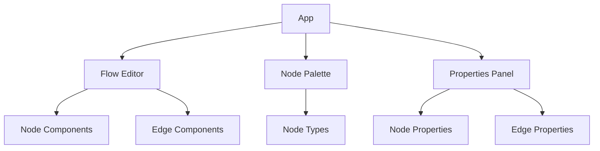

<frontmatter>
title: "Architecture"
layout: default.md
pageNav: 3
</frontmatter>

# Architecture

<div class="lead">
Understand the core architecture and design principles of O2DES Studio.
</div>

## Overview

O2DES Studio is built with a modular architecture focusing on:

-   Extensibility
-   Maintainability
-   Performance
-   Type safety

## Core Components

### Frontend Architecture



### State Management

-   Global state using Zustand
-   Local component state
-   Flow state management
-   Undo/Redo system

## Data Flow

1. User interactions
2. State updates
3. Flow rendering
4. Property updates
5. Persistence

## Extension Points

-   Custom node types
-   Custom edge types
-   Custom properties
-   Custom behaviors

## Project Structure

```
src/
├── app/              # Next.js App Router pages and layouts
├── components/       # Reusable UI components
│   ├── ui/          # Base UI components
│   └── nodes/       # Custom node components
├── lib/             # Utilities, constants, and helpers
├── stores/          # Global state management (Zustand)
└── types/           # TypeScript type definitions
```

## Core Components

### Node System

<box type="info">
The node system is the heart of O2DES Studio, allowing users to create and connect simulation components visually.
</box>

```typescript
interface NodeData {
    id: string;
    type: string;
    position: { x: number; y: number };
    data: Record<string, any>;
}
```

Each node:

-   Extends `BaseNode`
-   Implements required interfaces
-   Provides custom styling and behavior
-   Supports drag-and-drop interactions

### State Management

We use Zustand for state management, split into logical slices:

-   `useFlowStore`: Manages the flow diagram state
-   `useProjectStore`: Handles project-level state
-   `useUIStore`: Controls UI-specific state

Example store structure:

```typescript
interface FlowState {
    nodes: Node[];
    edges: Edge[];
    selectedNodes: string[];
    addNode: (node: Node) => void;
    removeNode: (nodeId: string) => void;
}
```

## Performance Considerations

<tabs>
  <tab header="Rendering">
    * Use React.memo for pure components
    * Implement useCallback for event handlers
    * Leverage useMemo for expensive computations
  </tab>
  <tab header="State">
    * Use shallow selectors with Zustand
    * Implement state normalization
    * Batch updates when possible
  </tab>
</tabs>

## Component Development Guidelines

<panel type="seamless" header="**Component Structure**" expanded>

1. **Base Components** (`components/ui/`)
    - Follow atomic design principles
    - Use TypeScript interfaces
    - Support theming
2. **Node Components** (`components/nodes/`)
    - Extend BaseNode
    - Implement required interfaces
    - Support custom styling
    - Handle user interactions

</panel>

## Error Handling

We implement a comprehensive error handling strategy:

<box type="warning">

-   Use TypeScript for compile-time checks
-   Implement runtime validations
-   Use error boundaries for critical components
-   Provide user-friendly error messages

</box>

## Testing Strategy

```typescript
// Example test structure
describe("NodeComponent", () => {
    it("renders correctly", () => {
        // Test rendering
    });

    it("handles interactions", () => {
        // Test user interactions
    });
});
```

## Contributing

See our [Contributing Guide](contributing.html) for detailed information on:

-   Setting up the development environment
-   Code style guidelines
-   Pull request process
-   Testing requirements
