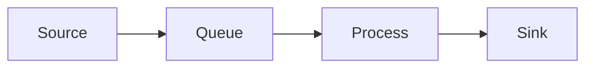

<frontmatter>
title: "Getting Started"
layout: default.md
pageNav: 2
</frontmatter>

# Getting Started with O2DES Studio

<div class="lead">
Learn how to create your first simulation model using O2DES Studio.
</div>

## Installation

<box type="tip" header="Prerequisites">

-   Node.js 18.0 or higher
-   npm or yarn package manager
-   Git (optional)

</box>

```bash
# Clone the repository
git clone https://github.com/your-username/o2des-studio.git

# Navigate to project directory
cd o2des-studio

# Install dependencies
npm install

# Start development server
npm run dev
```

## Creating Your First Model

<tabs>
  <tab header="1. Create Project">
    1. Click "New Project" in the top menu
    2. Enter a project name
    3. Choose a template (or start blank)
    4. Click "Create"
  </tab>
  <tab header="2. Add Nodes">
    1. Drag nodes from the sidebar
    2. Position them on the canvas
    3. Configure node properties
  </tab>
  <tab header="3. Connect Nodes">
    1. Click and drag from a node's output handle
    2. Connect to another node's input handle
    3. Configure connection properties
  </tab>
</tabs>

## Basic Workflow

<panel type="seamless" header="**Step-by-Step Guide**" expanded>

### 1. Node Types

-   **Source**: Generates entities
-   **Process**: Handles entity processing
-   **Queue**: Manages entity queuing
-   **Sink**: Removes entities from simulation

### 2. Connections

-   Connect nodes using handles
-   Configure flow properties
-   Set routing conditions

### 3. Properties

-   Double-click nodes to edit properties
-   Use the properties panel
-   Configure simulation parameters

</panel>

## Example Model

Here's a simple queuing system:



## Keyboard Shortcuts

<box type="info">

| Action      | Shortcut             |
| ----------- | -------------------- |
| Delete Node | Delete/Backspace     |
| Copy        | Ctrl/Cmd + C         |
| Paste       | Ctrl/Cmd + V         |
| Undo        | Ctrl/Cmd + Z         |
| Redo        | Ctrl/Cmd + Shift + Z |

</box>

## Next Steps

-   Learn about [Basic Features](basicFeatures.html)
-   Explore [Advanced Features](advancedFeatures.html)
-   Check out example models in the [Templates](templates.html) section

<panel type="success" header="**Pro Tips**" expanded>

-   Use the grid snap feature for clean layouts
-   Save your work frequently
-   Start with simple models and gradually add complexity
-   Use the built-in validation tools

</panel>
